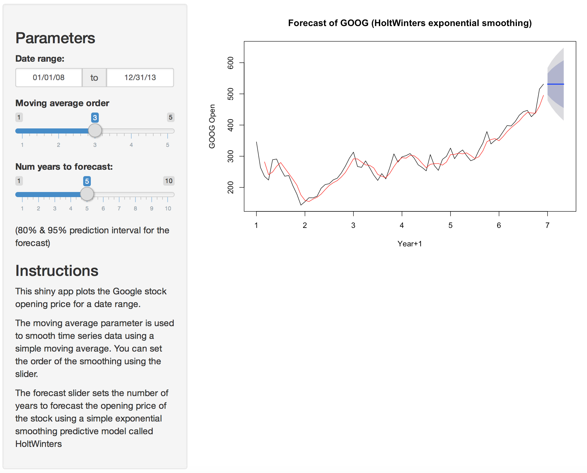

Shiny app: Forecast of GOOG stock
========================================================
author: Andreas Rimbe
date: June 21, 2015

Introduction
========================================================

This is a simple shiny app that forecast the opening stock price of Google's stock (GOOG).

The app can be found here: [Forecast of GOOG stock](https://anrim.shinyapps.io/shiny-timeseries)

What does the app do?
========================================================

The app plots a timeseries of Google's opening stock price for a selected date range.

Parameters that can be adjusted:

**Date range** - The date range to forecast the stock

**Moving average order** - a slider to the order of the moving average (using SMA from TTR package)

**Number of years to forecast** - a slider to set the number of years to forecast. The forecast is created by a simple exponential smoothing predictive model using HoltWinters. The darker blue indicates the 80% prediction interval and the lighter blue the 95% prediction interval.

Moving Average Trend
========================================================

The plot shows a [moving average](https://en.wikipedia.org/?title=Moving_average), which is a smoothing method to estimate the trend. The SMA() function in the [TTR](http://cran.r-project.org/web/packages/TTR/index.html) package is used to calculate the moving average.

Moving average is used to analyze data points by creating a series of averages of different subsets of the full dataset.

Exponential Smoothing Predictive Model
========================================================

An [exponential smoothing](https://en.wikipedia.org/wiki/Exponential_smoothing) predictive model is used to make short-term forecasts of the time series.

The predictive model is fit using the [HoltWinters](http://www.inside-r.org/r-doc/stats/HoltWinters) function.

We then use the forecast.HoltWinters to make forecasts for future time points. The `h` parameter is used to set the nuber of years in the future we want to to forecast.

